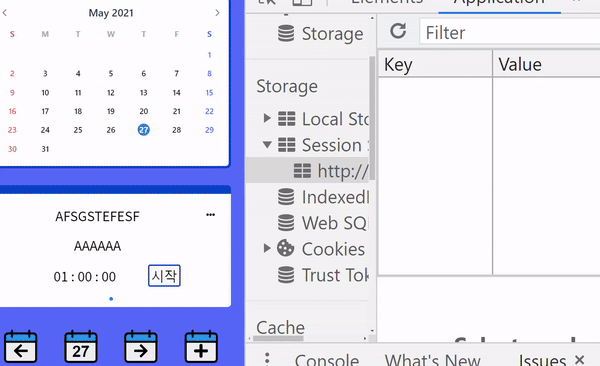
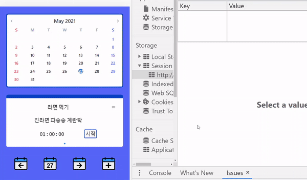
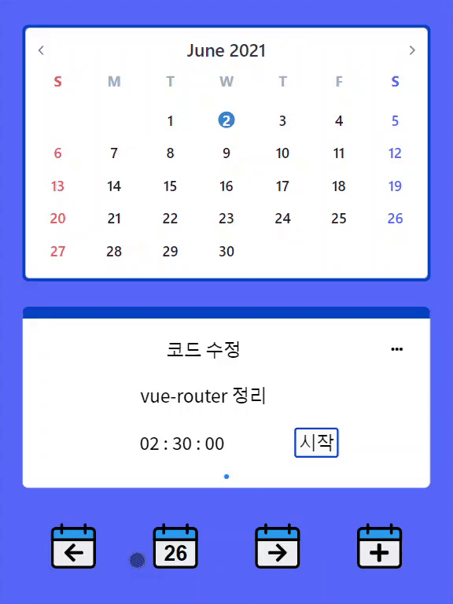

# Timer-Calendar-Todolist

> 일을 하거나 공부를 할 때, 타이머(시간측정)를 사용하면, 내가 얼마나 효율적으로 시간을 사용하고 있는지를 확인할 수 있습니다.  
> 저의 경우 그날 해야 될 것을 적어놓고, 스탑워치를 사용하여 '얼마나 집중했는지'를 기록합니다.  
> 이때 ‘Todolist와 Timer를 합치면 좋겠다’ 라는 생각을 하게 되었고, Timer-Todolist를 만들게 되었습니다.

## What i use

### Framework - [Vue3](https://v3.vuejs.org/)

[](https://v3.vuejs.org/)

### Library - [Vue-Router](https://next.router.vuejs.org/) + [V-Calendar](https://vcalendar.io/) + [swiper](https://swiperjs.com/vue) + [momentJs](https://momentjs.com/) + [Typscript](https://www.typescriptlang.org/)

[](https://next.router.vuejs.org/)
[](https://vcalendar.io/)
[](https://swiperjs.com/vue)
[](https://momentjs.com/)
[](https://www.typescriptlang.org/)

### DB - [JSONPlaceholder](https://jsonplaceholder.typicode.com/)

## 목차

- 기능 (Features)
- 파일 구조 / component 등
- 설치 및 실행
  - 본 파일
  - 서버
- icon 이미지 등 - fontawsome, flaticon

## 설치 및 실행 방법 / Build Setup

```
  npm 6.X 사용자의 경우

  1. npm install -g npm@latest ( 7.x 대로 업그레이드 후 이용하시거나)
                    #### OR
  2. npm i @popperjs/core ( 6.x대에서는 지원이 안되므로, 따로 설치하셔야 합니다.)
```

```
  npm 7.x 사용자 경우

  npm install
  npm run dev
  npm run build
  npm run serve
```

```
  DB Json-server
  json-server --watch db.json -p 3005
                    #### OR
  npx json-server --watch db.json -p 3005( json-server: command not found라 출력시)
```

## structure

```
  src
    |---aseets
    |       |---images
    |
    |---componets
    |       |---timer-animation
    |       |         |--- TimerAnimation.vue
    |       |         |--- timer-animation.css
    |       |         |--- image-incoding.ts
    |       |
    |       |---todo-date
    |       |---todo-form
    |       |---todo-tiemr
    |       |---todoList
    |
    |---pages
    |       |---calnedar
    |       |       |---Calnedar.vue
    |       |       |---calnedar.css
    |       |
    |       |---create-edit-todo
    |       |---start-todo
    |
    |---router
    |---App.vue
    |---index.css
    |---main.ts
    |---shims-vue.d.ts

```

### 이미지 참고 사이트 - fontawsome , flaticon

##### Live

   
   
    


## Timer-Todolist

### 타이머 애니메이션

|                 20초 이상                  |                 10초~20초                  |                  5초~10초                  |                  0초~5초                   |                    완료                    |                    종료                    |
| :----------------------------------------: | :----------------------------------------: | :----------------------------------------: | :----------------------------------------: | :----------------------------------------: | :----------------------------------------: |
|  |  |  |  |  |  |

|              Timer-Session-Storage               |
| :----------------------------------------------: |
|  |

### 생성

|                      Todo 생성 세션                       |                     Todo 수정 세션                      |                       Todo 생성                       |                  Todo 수정                   |                    Todo 삭제                     |
| :-------------------------------------------------------: | :-----------------------------------------------------: | :---------------------------------------------------: | :------------------------------------------: | :----------------------------------------------: |
|  |  |  |  |  |

### 수정

|                 Todo 없을 경우                  |                Todo 있을 경우                |                  Swipe 기능                  |
| :---------------------------------------------: | :------------------------------------------: | :------------------------------------------: |
|  |  |  |

### 삭제

생성 수정 삭제

|         Todo-모달(값을 입력 안했을 때)          |                       날짜 변경                       |                      날짜 변경                      |                      Home-btn                      |
| :---------------------------------------------: | :---------------------------------------------------: | :-------------------------------------------------: | :------------------------------------------------: |
|  |  |  |  |

홈버튼, 날짜-변경, 모달

### 아이템, 스와이프

|                 Todo 없을 경우                  |                Todo 있을 경우                |                    Swipe                     |
| :---------------------------------------------: | :------------------------------------------: | :------------------------------------------: |
|  |  |  |

### 날짜

|            어제, 내일 이동             |            오늘 날짜로 이동            |                월 이동                 |         날짜 잘 못 선택시 모달         |              팝업 캘린더               |
| :------------------------------------: | :------------------------------------: | :------------------------------------: | :------------------------------------: | :------------------------------------: |
|  |  |  |  |  |

### 세션

|            어제, 내일 이동             |            오늘 날짜로 이동            |
| :------------------------------------: | :------------------------------------: |
|  |  |

### CRUD

|            어제, 내일 이동             |
| :------------------------------------: |
|  |

# 다른 버전

## 타이머 애니메이션

|                 20초 이상                  |                 10초~20초                  |                  5초~10초                  |                  0초~5초                   |                    완료                    |                    종료                    |
| :----------------------------------------: | :----------------------------------------: | :----------------------------------------: | :----------------------------------------: | :----------------------------------------: | :----------------------------------------: |
|  |  |  |  |  |  |

## session-storage 활용

|                          Timer                           |
| :------------------------------------------------------: |
|  |

|                        생성session                        |
| :-------------------------------------------------------: |
|  |

|                        수정 기능                        |
| :-----------------------------------------------------: |
|  |

## date 이동

|                 전날 이동                 |                다음날 이동                 |            오늘 날짜로 이동            |
| :---------------------------------------: | :----------------------------------------: | :------------------------------------: |
|  |  |  |

|                월 이동                 |              팝업 캘린더               |         날짜 잘 못 선택시 모달         |
| :------------------------------------: | :------------------------------------: | :------------------------------------: |
|  |  |  |

## 아이템, 스와이프

|                 Todo 없을 경우                  |                Todo 있을 경우                |                    Swipe                     |
| :---------------------------------------------: | :------------------------------------------: | :------------------------------------------: |
|  |  |  |

## 생성,수정,삭제

|                    Todo 생성                     |                  Todo 수정                   |                    Todo 삭제                     |
| :----------------------------------------------: | :------------------------------------------: | :----------------------------------------------: |
|  |  |  |

## 기타 기능

|         Todo-모달(값을 입력 안했을 때)          |                      날짜 변경                      |                      Home-btn                      |
| :---------------------------------------------: | :-------------------------------------------------: | :------------------------------------------------: |
|  |  |  |
|         반응형(w: 320~768, h: 568~1024)         |                       반응형                        |
|    |        |

|        반응형(w: 320~768, h: 568~1024)        |                    반응형                     |
| :-------------------------------------------: | :-------------------------------------------: |
|  |  |
